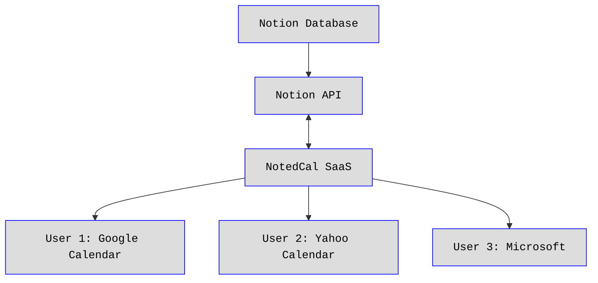
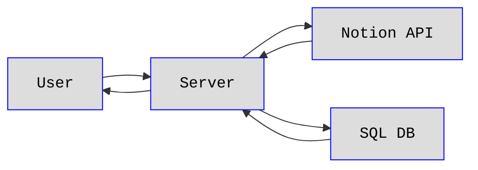

# NotedCal — Notion → Google Calendar Sync

## Description

This software will create a subscribable calendar feed from a specified Notion Database

* This software will made public as a SaaS, called **NotedCal**.
* I am thinking that I will use **Javascript**. Server will be `Express`, Date Util will be `Luxon`, and the Notion API Connection will be via the `notion-sdk-js`.

**NotedCal is NOT a 2-way sync**. It just returns a url feed for calendar subscription.

### Flow



The SaaS will expose an endpoint like:

```js
// Express
app.get("/calendar/:calendarId.ics", (req, res) => {
  /*** Send a ics file stream with an event for each DB item in
  Notion ***/
});
```

with each calendar feed gets its own UUID (maybe use the Notion db id?).
Each User's Notion DB id and API key will be stored in a SQL DB (Likely [Supabase](https://supabase.com), or Zite DBs if I use [Zite](https://zite.com) to build the user portal).



When the User's Calendar requests calendar data from the url (`example.com/calendars/<calendarID>.ics`), NotedCal will query the database for Notion API data for the path's calendar ID. It will then make a Notion query to retrieve events from Notion, format the data and return an **iCal** file containing the event data.

## Data Storage

Primary Choice: Turso (SQLite at the Edge)

> [Turso Site](https://turso.tech)

* Reasoning: Turso provides managed SQLite with optional edge replication. For this project:
* We can start with a single replica (primary only) to avoid write conflicts.
* Reads and writes will go to the same instance, ensuring consistency.
* As the project scales, replicas can be added to improve global read performance.
* Pros: Simplicity of SQLite, massive free tier, low latency when colocated with Vercel.
* Cons: Fewer advanced features than Postgres, eventual consistency if replicas are introduced later.

Alternative: Supabase (Postgres)

* A more feature-rich option with built-in auth, row-level security, and Postgres features.
* Would add some latency since it’s an external service, but integrates well with Vercel.
* More overhead than needed for the current scope.

### Tenative Database Schema (for Turso / SQLite)

#### users

* id (TEXT, primary key, UUID)
* email (TEXT, unique)
* password\_hash (TEXT) — if not using external auth
* api\_key (TEXT, encrypted/hashed)
* created\_at (TIMESTAMP)

#### calendars

* id (TEXT, primary key, UUID)
* user\_id (TEXT, foreign key → users.id)
* notion\_db\_id (TEXT)
* name (TEXT, optional, human-friendly label)
* created\_at (TIMESTAMP)

### Notes

* Start with Turso single replica colocated with the Vercel serverless deployment.
* If global performance becomes necessary, add replicas and tolerate eventual consistency on reads.
* Authentication and encryption of API keys must be handled at the application layer.
* ICS feeds are generated dynamically from the DB and served through Vercel functions.

## Code

> **In Progress...**

### Example Notion API Response for Dates

```js
{
  "id": "abc123",
  "type": "date",
  "date": {
    "start": "2025-09-18T12:00:00.000Z",
    "end": "2025-09-18T13:00:00.000Z",
    "time_zone": "America/New_York"
  }
}
```

* The ISO 8601 string (start / end) may or may not contain an offset.
* If Notion includes an offset (-04:00), that’s enough to compute UTC directly.
* If it’s a plain UTC (...Z), then it’s already UTC.
* The time\_zone field is extra metadata (IANA zone name).
* Example: "America/New\_York".
* This isn’t encoded into the ISO string itself but can be used if you want to render in local time.

So:

* If the ISO string has an offset, libraries can parse it directly.
* If it doesn’t, the time\_zone field is what tells you the context.

### Date Helper Util

> This helper fixes the problem described above

```js
import { DateTime } from "luxon";

function reformatDate(dtStr, tzStr = null) {
  // If tzinfo in ISO string, Luxon handles it
  let dt = DateTime.fromISO(dtStr, { zone: tzStr || "utc" });

  // Convert to UTC and format as ICS
  return dt.toUTC().toFormat("yyyyMMdd'T'HHmmss'Z'");
}
```
